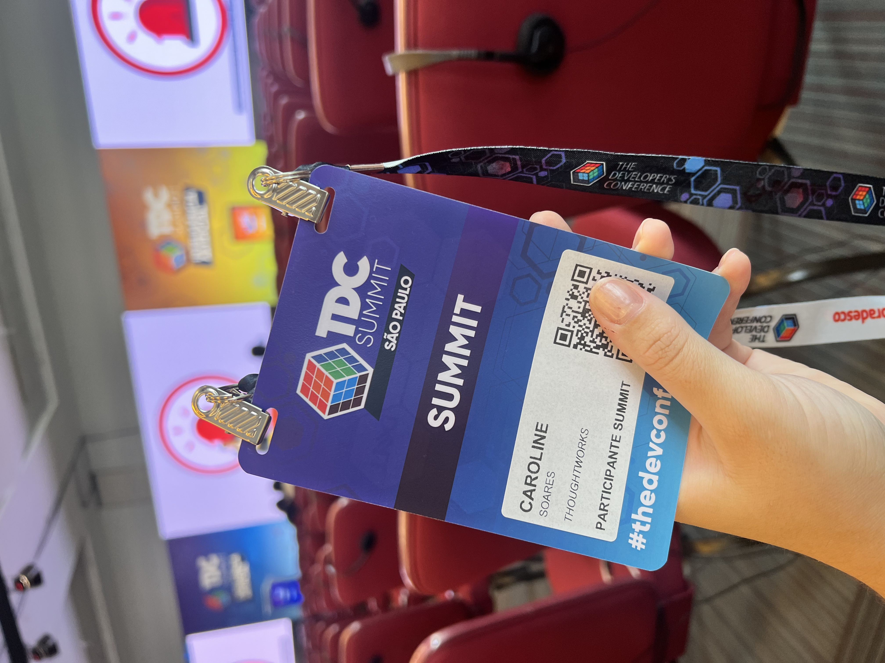
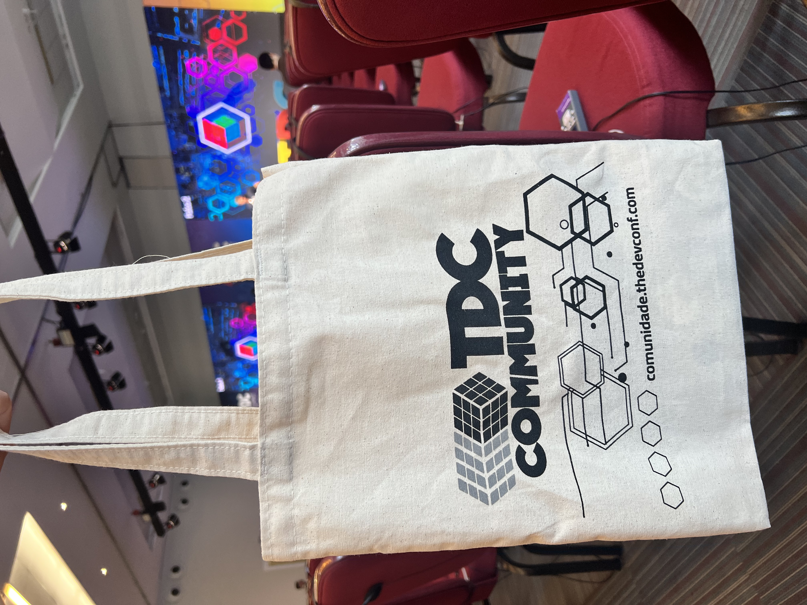

It’s been about 9 months since I started working on developing solutions using artificial intelligence — with a particular focus on generative AI. In recognition of my contributions, my company awarded me the opportunity to attend TDC — The Developer Conference AI, that happen in São Paulo, Brazil.

This conference is aimed at developers connecting with each other, discovering new trends, discussing best practices, sharing knowledge, etc. It was my first time attending a conference, and honestly, I felt like Sheldon! 😂😂

I’m someone who, on the surface, seems sociable, but I hate being in large crowds and never really got excited about these types of events. I always thought they were overrated. I don’t even believe in astrology, but I’ll blame it on my sign today hahahaha.

The conference took place on March 26th and 27th, 2025, and it focused on artificial intelligence. There were several panels covering various topics related to generative AI. In general, the panels discussed how AI is being applied in different areas like healthcare, agriculture, software development, everyday life, and more. And I’d love to share some of the themes that impacted me the most.

The first panel that really struck me was from a company that uses AI to monitor neonatal ICUs. Through the electrodes placed on the babies, data is collected and analyzed in real time by a system using generative AI. The case presented involved a newborn with complications. When the baby started having significant changes that required medical intervention, the system had already identified the issue *hours in advance* — the baby was having an epileptic seizure. With this analysis, doctors were able to act quickly, and the baby survived. In fact, the baby is now healthy and growing well, under medical supervision of course. Incredible, right? I was deeply moved by this case!

The second impactful panel was about the use of generative AI in agriculture. They showed how AI is transforming the industry through soil, weather, and livestock analysis... The presenter even showed AI-powered cameras being used for these analyses, for example. One thing I was curious about was the stereotype that people in agriculture are resistant to technology. The speaker explained that the new generation in agribusiness is much more open to using technology in their daily work, and even many from older generations understand its importance now. It was really cool!!

The third panel that impressed me was a presentation by a team working on modernizing legacy code. With the help of generative AI, a parte of the code that was expected to take a year to be complete, actually took 6 months. Amazing, right? That’s a huge time savings!

What I enjoyed most about the talks I participated, was that the speakers emphasized the importance of using AI consciously and responsibly. And this goes way beyond just using AI for anything—it’s about knowing why you’re using it, applying prompt engineering to get accurate responses, validating whether the AI's response is correct, checking if it’s "hallucinating," and so on. Not to mention the environmental impact of AI usage, which is a real can of worms—girl, it’s scary!

This conference was amazing! I had so much fun, learned a lot, and met some incredible professionals! For example, I participated in a mentorship focused on working on international projects, which is exactly the direction I want my career to go right now. I absolutely loved it and I think the experience is totally worth it!

Negative points:
 - The location wasn’t great, and there weren’t any nearby restaurants to have lunch without a long walk—which I didn’t love.
 - The food experience was poor. The event had announced that there would be partner food vendors, but in the end, there weren’t any. There was a communication failure, which was a big deal since I spent the whole day there. Especially because I was alone and didn’t feel safe walking around that part of São Paulo on my own.

Positive points:
 - The venue itself was really nice.
 - I got a bunch of free goodies, which was super fun!

 - The "silent presentation" format was the coolest part: basically, three panels were happening at the same time. We wore headphones and could switch stations at any time to follow whichever presentation we wanted.
 - I really enjoyed the networking, the spaces, the mentoring sessions, and the companies that were there!

All in all, it was absolutely worth it!

